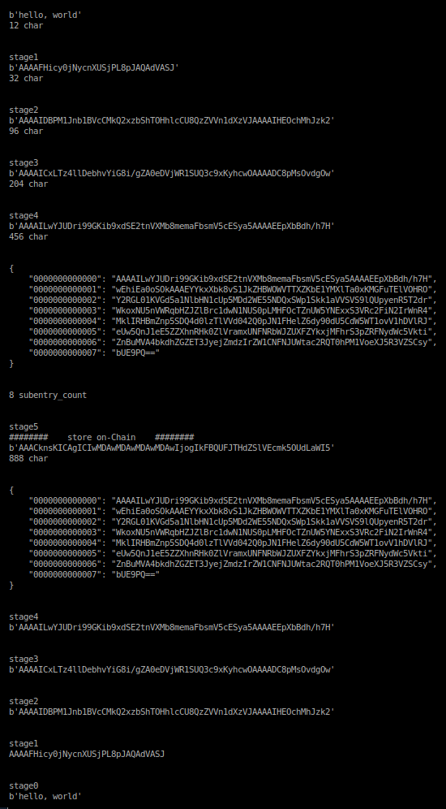

<br />





<br />


##   MM : Money! Maker


```json:

Block
{
    #  Need To Know basis
    #  Confidential
    #  between Alice & Bob

    "block_height" : 0,
    "header_hash"  : "",

    "header" : {
        "version" : "",
        "brand" : "Money! Maker",
        "chunk_count" : 3,
        "checksum" : "",
        "nonce" : "",
        "timestamp" : 0,
    },

    #  download & sync
    #  locked shields & stealth

    #  only Alice & Bob
    #  can decipher

    #  No Need Storage Fee

    "chunk" : [
        {
            "000" : "32-bytes"
        },
        {
            "001" : "32-bytes"
        },
        {
            "002" : "32-bytes"
        },
    ],
}

```


<br />


```json:

on-chain Auction
New Account Activation =
{
    "sell 1 MM" : "buy 1 IDR",
    "holders" : 100,
    "minimal buy" : 1.000.000 IDR",
    "scarcity" : "100.000.000. IDR"
}

```


<br />


```json:

Exchange Rate =
{
    "1 XLM" : "2.000 IDR",
}

```


<br />


```

  1st deliverable
  Android based smartphone

  retrieve encrypted Message
  Hidden & Isolated endpoint

  New Account Activation 
  Minimal Balance 
  1.000.000 IDR

  All Operations
  Instant Liquidity

  Storage
  relevant end-to-end Replication

  KYC
  Know You Client
  Must provide Real Name

  Preserving Privacy
  Assets Values Holdings

```
