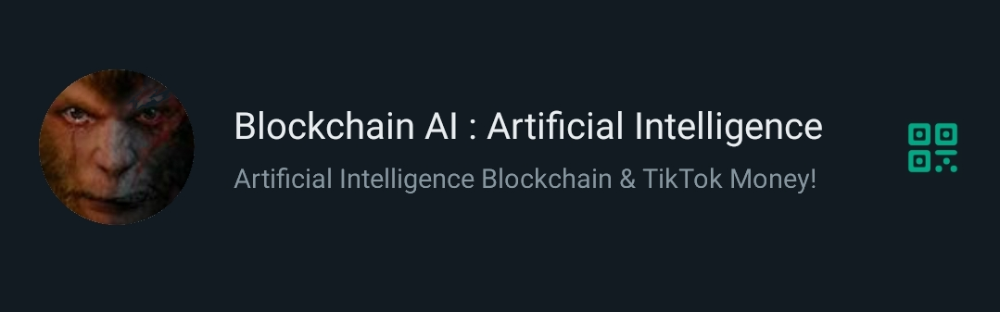

<br />


```json:
Accept IDR : Indonesian Rupiah
```


<br />


```json:
each Node/ Ponsel/ Phone/


offers
Auctions Store Public Message


Chunk  1 :  1 IDR Minimum fee
to
Chunk  1 : 10 IDR Maxumum fee


1 chunk subentry
allocate
maximum store 64 characters
```


<br />


```json:
Message Schema


code ->  State Machine
data ->  State Variable
```


<br />


```json:
P2P Message Mining Pool


POST_public_message
```


<br />


```json:
bootstrap
to
BIMA Pin id


G_bima       public

S_stellar    secret
G_stellar    public

S_router     secret
G_router     public

S_locker     secret
G_locker     public

S_signer     secret
G_signer     public
```


<br />


```json:
High Assets Values Secret
{
    index
    hash

    header
    {
        replicate tx id

        states
        [
            bootstrapping,
            mining,
            messaging
        ],

        subentry_count
    },

    values
    {
        collection
        of
        chunks
    },
}
```
