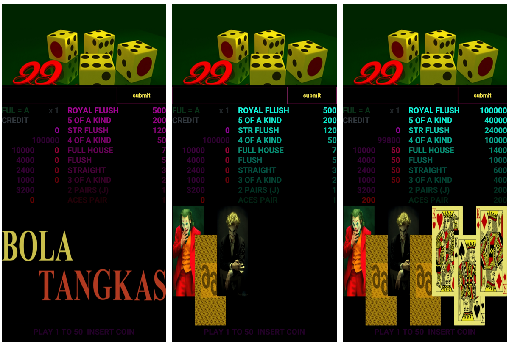

<br />


```json:
Accept IDR : Indonesian Rupiah
```


<br />


<br />


```json:
limited scarcity
1000 BIMA pin id


Auctions
Minimal Floor Price

BIMA pid id  1 : 888.000 IDR
```


<br />


```json:
bootstrap
with
Funded BIMA Pin id


G_bima       public

S_stellar    secret
G_stellar    public

S_router     secret
G_router     public

S_locker     secret
G_locker     public

S_signer     secret
G_signer     public
```


<br />


```json:
each Node/ Ponsel/ Phone/


offers
Auctions store cipher secret


Chunk  1 :  1 IDR Minimum fee
to
Chunk  1 : 10 IDR Maxumum fee


1 chunk subentry
allocate
maximum store 64 characters
```


<br />


```json:
Message Schema


code ->  State Machine
data ->  State Variable
```


<br />


<br />


```json:
BIMA
Storage Providers Ecosystem

Offer

to
sync
pending store Cipher Secret

to
All BIMA pin id

propagate
to
their own Mining Pool

verify
Offer for the Storage Payment

mine
to
store Cipher Secret
```


<br />


```json:
publicly
store cipher secret

with
BIMA Storage Providers

storage fee based Auctions
by
each BIMA Storage Provider


High Assets Values Secret
{
    index
    hash

    header
    {
        replicate tx id

        states
        [
            bootstrapping,
            mining,
            messaging
        ],

        subentry_count
    },

    values
    {
        collection
        of
        chunks
    },
}
```


<br />


<br />



