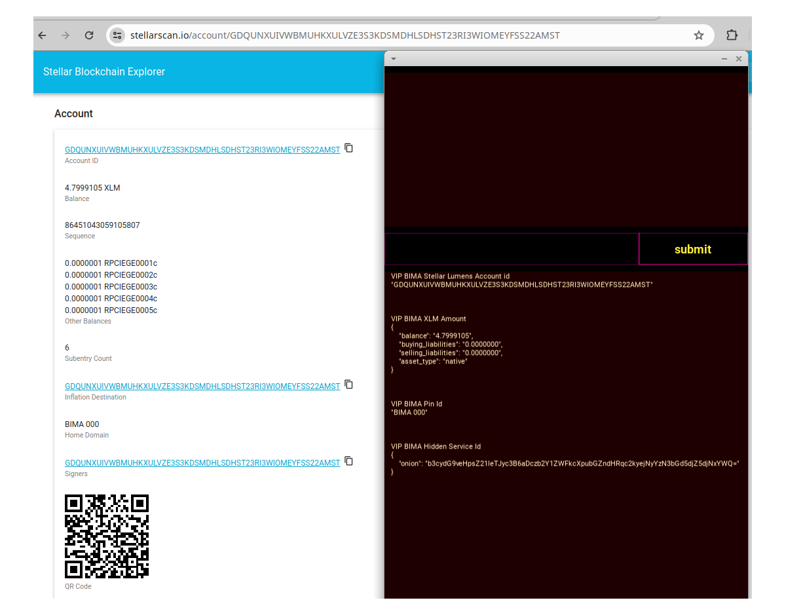
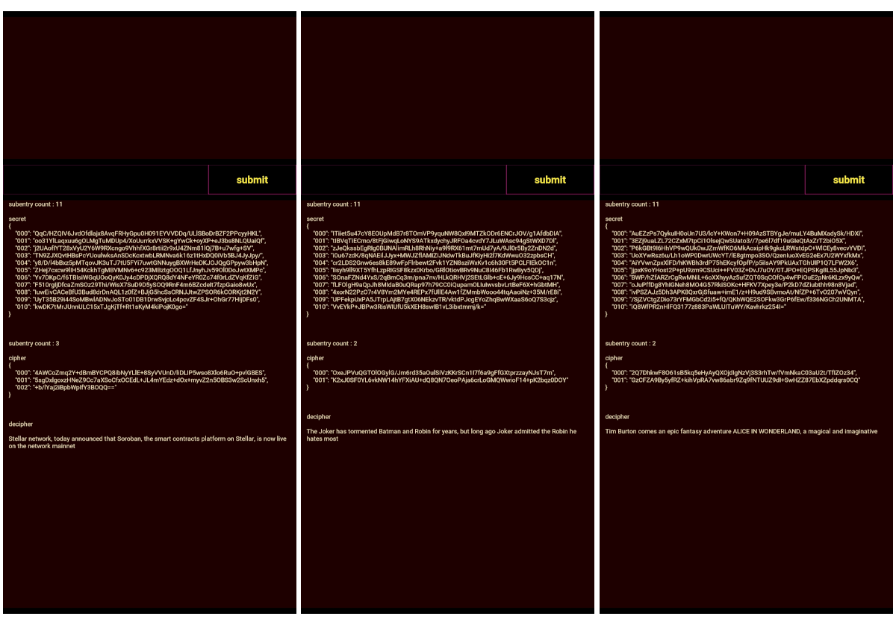
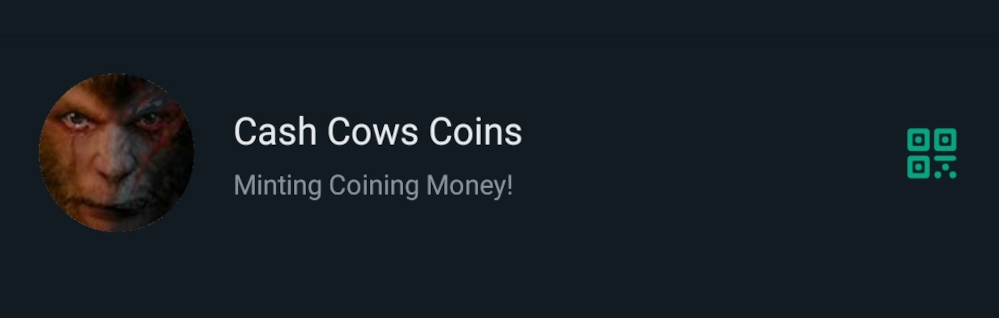

<br />


<br />


```json:
Offer
Pair Quality Liquidity Swap

Buy XLM Asset, Sell IDR Asset 
```


<br />


<br />





<br />


<br />


```json:
limited scarcity
1000 BIMA pin id


Auctions
Minimal Floor Price

BIMA pid id  1 : 888.000 IDR
```


<br />


<br />


```json:
bootstrap
with
Funded BIMA Pin id


G_bima       public

S_stellar    secret
G_stellar    public

S_router     secret
G_router     public

S_locker     secret
G_locker     public

S_signer     secret
G_signer     public
```


<br />


<br />


```json:
each Node/ Ponsel/ Phone/


offers
Auctions store cipher secret


price
Chunk  1 :  1 IDR Minimum fee

price
Chunk  1 : 10 IDR Maximum fee


1 chunk subentry
allocate
maximum store 64 characters
```


<br />


<br />


```json:
Message Schema


code ->  State Machine
data ->  State Variable
```


<br />


<br />





<br />


<br />


```json:
BIMA
Storage Providers Ecosystem


add Cipher Secret
to your
own Cipher Secret Mining Pool

trigger synchronization
all pending stored Cipher Secret

broadcast
to
All Active Reachable BIMA id

inventory
Request their Mining Pool assets

GET
Cipher Secret from the BIMA id

allocate
to
your own Cipher Secret Mining Pool

verify
Offer Payment for Storage Provider


sender
Sponsor Minimum  1.000 IDR
per
Storage Provider

sender
Sponsor Maximum 10.000 IDR
per
Storage Provider


append
Cipher Secret to your Storage

await Recipient
invoke stored Contract id

Claimant
of Contract id storage fee

```


<br />


<br />


```json:
publicly
store cipher secret

with
BIMA Storage Providers

storage fee based Auctions
by
each BIMA Storage Provider


High Assets Values Secret
{
    index
    hash

    header
    {
        replicate tx id

        states
        [
            bootstrapping,
            mining,
            messaging
        ],

        subentry_count
    },

    values
    {
        collection
        of
        chunks
    },
}
```


<br />


<br />





<br />


<br />


```json:
BOLATANGKAS
New Mint MM Contract id


Table
  2.000 IDR          COIN-IN

per
Contract id   1 : 1  MM Session
Minimal Buy  50      Contract id


Table
 20.000 IDR          COIN-IN

per
Contract id   1 : 1  MM Session
Minimal Buy  50      Contract id


Table
200.000 IDR          COIN-IN

per
Contract id   1 : 1  MM Session
Minimal Buy  50      Contract id
```


<br />


<br />


<br />
