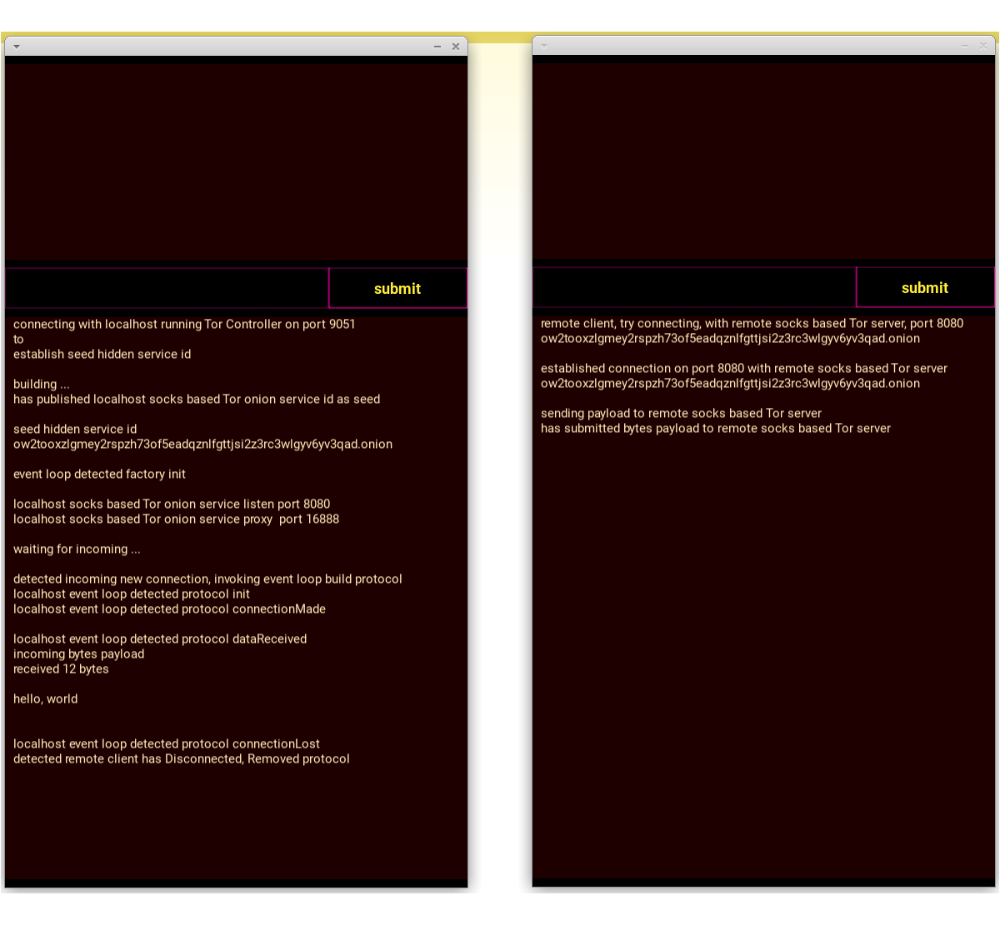

<br />


```json:
Levels of Obfuscation

      m

z            z
x            x
c            c
a            a
h            h
s            s
e            e

[            [
                                      
    {            {
        k            k
        n            n
    },           },

    {            {
        k            k
        v            v
    },           },

    {            {
        p            p
    },           },

]            ]

r            r

b b b    h    b b b
On-Chain VIP-to-VIP
Safe Secure Secrets
```


<br />


```json:
Minimum Viable Product

deliverables, no risks
deliver meaningful project

Lean Blockchain Start-up
with
clearly defined scope

build
for
Blockchain based Message

features
to
attract early-adopter

ways
towards quality solution

on
Github
```


<br />


```json:
Genesis Block {

    "index"

    "hash"

    "header" : {
        "version"
        "chain_id"
        "prev_hash"
        "state_hash"
        "subentry_count"
        "nonce"
        "timestamp"
    },

    "state" :  [
        "IDR issuer"
        "IDR holders"
        "IDR auctions"
        "VIP whitelist" 
        "Finite State Machine"
        "state variables data" 
        "32-bytes size chunks" 
        "Mining IDR as Claimant"
    }
}
```


<br />


<br />


<br />


<br />


<br />


```json:
you've The Asset

do
you've The Liquidity ?
```


<br />


```json:
Eleven (11) Bima id

each Bima id Trustline
100.000.000.000.000 IDR

Offer
Sell IDR, Buy XLM


issue
IDR

backed by
XLM


Swap Operations
Smart Contract based

Trade Operations
Smart Contract based

Auctions Operations
Smart Contract based


invoke Smart Contract GAS
1.000 IDR 

store Cipher Message FEE
1.000 IDR


IDR

powered GAS & FEE
```


<br />


```json:
Advanced  Account / Wallet


Asset {

    symbol       IDR

    issuer       Bima 000
    supply       Trustline limit
    balance      amount

    issuer       Bima 111
    supply       Trustline limit
    balance      amount

    issuer       Bima 222
    supply       Trustline limit
    balance      amount

    issuer       Bima 333
    supply       Trustline limit
    balance      amount

    issuer       Bima 555
    supply       Trustline limit
    balance      amount

    issuer       Bima 666
    supply       Trustline limit
    balance      amount

    issuer       Bima 777
    supply       Trustline limit
    balance      amount

    issuer       Bima 888
    supply       Trustline limit
    balance      amount

    issuer       Bima 999
    supply       Trustline limit
    balance      amount

    issuer       Bima 168
    supply       Trustline limit
    balance      amount

    issuer       Bima 838
    supply       Trustline limit
    balance      amount


    circulation  amount
    number of    holders

    Sell         Offer
    Buy          Offer

    Ask          Offer
    Bid          Offer

    base Reserve amount
    GAS          amount
    FEE          amount

}
```


<br />


```json:
Alice

designs of State Machines
online & offline Messaging


data   structures       schema
data   acquisition      system

New Mint     Block      on blockchain
preserve   history      minting coining

Smart Contract based    State Machines


store                                      store                                      store
Genesis Block                              ongoing Block                              ongoing Block


finalized                                  finalized                                  finalized
a                                          a                                          a
file                                       file                                       file


-r--r--r--    blk000000000.dat             -r--r--r--    blk000000001.dat             -r--r--r--    blk000000002.dat
                                  


blockspace {                               blockspace {                               blockspace {


    block_height                               block_height                               block_height


    header_hash                                header_hash                                header_hash

    header {                                   header {                                   header {
        version          :  str                    version          :  str                    version          :  str
        chain_id         :  str                    chain_id         :  str                    chain_id         :  str
        prev_header_hash :  str                    prev_header_hash :  str                    prev_header_hash :  str
        state_hash       :  str                    state_hash       :  str                    state_hash       :  str
        nonce            :  str                    nonce            :  str                    nonce            :  str
        timestamp        :  int                    timestamp        :  int                    timestamp        :  int
    },                                         },                                         },


    state {                                    state {                                    state {
        state_machine                              state_machine                              state_machine
        state_variables                            state_variables                            state_variables
        state_values                               state_values                               state_values
    },                                         },                                         },


}                                          }                                          }
```


<br />


```json:
Token is Powerful

in
Market! Makers High Value Asset
```


<br />


```json:
All Excellent Projects


Must
powered Market! Makers

in
Trade Exchange Assets

or
Ask Bid Fungible Assets

or
Swap Quality Liquidity

&
Decentralized Stored data
```


```json:
decentralized stored data

1)      Tamper  Resistance
2)  Censorship  Resistance

3)        data  Ownership
4)      Chains  Cyber Security

5)   Repudiate  Actions
6)  end-to-end  Locked Shields

7)     stealth  Operations
8)      Public  Relay Chains

9)  Efficiency  Growth, Cost, Scale
```


<br />


```json:
each Bima Chain is unique


All Bima Chains are Private

implied
your own Genesis Block
your own Secure  IDR Liquidity
your own Private Ledger

aka
running your own Blockchain


IDR

is
Indonesian Rupiah


Bima IDR

is
instant Indonesian Rupiah Payments


issued IDR

is
backed by Indonesian Rupiah Liquidity
```


<br />


```json:
your own Genesis

your own ongoing records
your own ongoing history
your own ongoing assets

your own Blockspace
your own Coretime
your own GAS & FEE
```


<br />


```json:
cipher blockspace

runtime
message
signers
memory  
storage 
```


<br />


```json:
Bima Blockchains Ecosystem
    explorer
    seeds
    peers
    storage providers
    smart contracts
```


<br />


```json:
IDR  Maximum Total  Supply
IDR    Circulation  Supply
IDR   24hr Trading  Prices
```


<br />


```json:
IDR prices
    Open
    High
    Low
    Close
```


<br />


```json:
bima_blockspace


block_height

header_hash

header {
    home_domain
    prev_header_hash
    state_hash
    num_chunks
    store_fee
    retrieve_fee
    nonce
    timestamp
},

state {
    G_source
    G_destination
    B_cipher_chunks
    B_secure_contract
    B_sponsor_claimant
    B_self_destruct_9d
}
```


```json:
Blockspace

implied
Stored cipher data

allocated
maximum for 9 days

removed
after 9 days

operation
Smart Contract based

stored data size
maximum 1000 cipher chunks
of
32-bytes, or 64-hex storage

features
empowering Blockchain protocol

store FEE
1.000 IDR

fetch FEE
1.000 IDR

Market! Maker
Stealth Addresses
Locked Shields
Repudiable Actions 

Communities
High Value Asset
Privacy Preserving
end-to-end cipher
```


<br />


```json:
bima_IDR

pairing pegging backing
with
Stellar Lumens XLM
```


<br />


```json:
bima_pin

pubkey -- encrypt
pubkey -- verify
```


<br />


```json:
bima_message

level of trust
```


<br />


```json:
bima_storage

chunk of 32-bytes
or
chunk of 64-hex
```


<br />


```json:
to
Activate New Account

or
Exist

w/
Cash Cows Coins
Blockchains Groups

Minimal Deposit
1.000.000 IDR


base Reserve
  100.000 IDR

Transaction Fee
    1.000 IDR

GAS execute Code
   20.000 IDR
```


<br />


<br />


<br />


<br />


```json:
Coin Ticker
SCB

Coin Name
Sponsor Claimable Balance

Issuer
Cash Cows Coins

Ledger
Instant Liquidity

Moto
Always Win. Never Lose.

Encrypted Privacy Ledger
True End-to-End

Pegging Pairing Backing
1 : 1
instant Indonesian Rupiah

Coin Fixed Total Supply
888.000.000.000 SCD

Swap Pair Coins
SCB 1 : 1 IDR

IDR
Indonesian Rupiah
```


<br />


```json:
unlock
True Decentralized Blockchain

with
True Global Opportunities

New
Mint Digital Assets

NFT
Whale Collector
issue
only One (1)

COINS
Financial System
issue
Sponsor Claimable Balance
```


<br />


```json:
Cash Cows Apps
```


<br />


```json:
Funds Money! Apps
```


<br />


```json:
Financial Game Apps
```


<br />


```json:
Making Money! Apps
```


<br />


```json:
Minting Money! Apps
```


<br />


```json:
Poker Money! Tree
```


<br />


```json:
send Transactions

to
deploy cipher   code on blockchain

to
invoke execute  code on blockchain


stored data
state variables
```


<br />


```json:
All our native assets coins on chains

are
Guarantee

1 : 1

to
All Investors, Collectors, Institutions
```


<br />


```json:
instant New Mint Cipher Block on Chains
```


<br />


```json:
height : 0,

header_hash :  "",


header : {

    server    :  ".onion"
    network   :  "MainNet, Cash Cows Coins",

    prev_header_hash :  "",

    operation :  "",
    nonce     :  "",
    timestamp :  "1710033678",

    code_merkle_root :  "",
    data_merkle_root :  "",

}


code ; {

   "000" :  "base64 encoding",
   "001" :  "base64 encoding",
   "002" :  "base64 encoding",

    ...


   "998" :  "base64 encoding",
   "999" :  "base64 encoding",

}


data ; {

   "000" :  "base64 encoding",
   "001" :  "base64 encoding",
   "002" :  "base64 encoding",

    ...


   "998" :  "base64 encoding",
   "999" :  "base64 encoding",

}
```


<br />


```json:
Money!
Guarantee
    1 : 1

    100 %
Guarantee
All HODLER of native asset IDR
```


<br />


```json:
native asset IDR

encrypted payment channel

CREDENTIAL based on BIMA id

Strong Security
Privacy Preserving
Safe & Confidential

No HODL, No Wealth!

stored peer encrypted blocks
50%
share Transaction fee commission

stored peer compiled executable
Smart Contract
50%
share GAS fee commission


backed
by
Asset of High Quality Liquidity

paired
with
Asset of High Quality Liquidity

pegged
to
Asset of High Quality Liquidity


instant Payment
Swap  "pair of COINS"  across All Chains

Non-Custodial wallet

running  your own  Blockchain
 mining  your own  New Mint Coin

Censorship Resistance
      Hack Resistance

distributed SHUFFLING
```


<br />


```json:
capabilities

Create    "Sponsor Claimant Liquidity"

&
Claim     "balance id"

or
invoke    "balance id"
```


<br />


```json:
Alice

send
Tx:Transaction

to
her Mempool

implied
it's pending confirmation

mine
New Mint Blocks on her Chain
```


<br />


```json:
Alice
broadcast her Tx:Transaction

to
All Active Reachable Nodes

to
their Mempool

implied
it's pending Tx confirmation

mine
New Blocks on their Chains
```


<br />


```json:
incentivize manage data

Alice
sponsor quality liquidity

in
excellent amount of XLM

to
Public Storage Providers

or
Public Blockchain infra


to mine
her New Mint Blocks

it's
send Transaction cipher data

deploy
to
public blockchain

for
Bob


minimal Claim amount
on
confirmation
of
Blocks on Chain


maximal Claim amount
when Bob access
the
encrypted Block
from
Storage Provider's Chain


or
Bob invoke Blocks
on
specific
Storage Provider's Chain


Storage Provider's Chain
is
Claimant of Maximum amount
```


<br />


```json:
send secure transaction
deploy
encrypted messaging
on
blockchain


Alice [
    has a Packet
    securely encrypted
    privately for Bob
]

retrieve Bob [
    latest public key
    from
    peers list
]

xdr Packer() [
    pack bytes packet
    packet hash
    sign hash
]

payload [
    base64 encode
]

Locked Shields [
    cipher payload
    with
    Bob's public key

    only
    Bob can unlock

    in
    Mining Pool
]


Create [
    New Block
    pack state variables

]

send transaction [
    deploy New Mint Block
]

Transaction Mining Pool [
    sync by Peer-to-Peer
]

Mempool [
    implies All Nodes in sync

    All nodes will receive
    Transmitted, or Submitted
   "Transaction cipher data"

    Bob can Mine what's his
    Bob can unlock his packet

    unlock
    cipher state variables
]

```


<br />


```json:
The Correct Proper Way

send
Tx : Transaction

deploy
cipher data

to
Blockchain

mining
Tx : Transaction

unlock
cipher state variables

```


<br />


```json:
Bootstrapping

      Startup
      Launching

      bootstrap set-of-heights
      available strengths & resources

     "Be Part of The Community"


* seeds

I/O bound   sync   continuous streaming


                   # The Onion Router
replicate   pub    Stealth Chains

                   # Cipher Secrets 
replicate   pub     Locked Shields

                    # eCash Payments    
replicate   pub     Assets Trustline    


* alice

I/O bound   sync   continuous streaming


replicate   pub    Stealth Chains
replicate   pub     Locked Shields
replicate   pub     Assets Trustline


* bob

I/O bound   sync   continuous streaming


replicate   pub    Stealth Chains
replicate   pub     Locked Shields
replicate   pub     Assets Trustline
```


<br />


```json:
what's your Repudiation Bima?
Bima-to-Bima Secrets on Chain


Stealth id : Alice sync {

    bima_000 : [ onion id ],
    bima_001 : [ onion id ],
    bima_002 : [ onion id ],

    bima_997 : [ onion id ],
    bima_998 : [ onion id ],
    bima_999 : [ onion id ],

}

stored Keys : Alice sync {

    bima_000 : [ bit-size ],
    bima_001 : [ bit-size ],
    bima_002 : [ bit-size ],

    bima_997 : [ bit-size ],
    bima_998 : [ bit-size ],
    bima_999 : [ bit-size ],

}

Locked Shields : Alice sync {

    bima_000 : [ ciphers ],
    bima_001 : [ ciphers ],
    bima_002 : [ ciphers ],

    bima_997 : [ ciphers ],
    bima_998 : [ ciphers ],
    bima_999 : [ ciphers ],

}

```


<br />


```json:
Market! Makers

Smart Contracts on Mobile! Money Blockchain {

    User_Interface : [
        #//!  interacting with Smart Contracts

        attribues & properties
    ],

    peers : [
        #//!  bootstrap node

        peer-to-peer list
    ],

    mempool : [
        #//!  deploy Contract

        pending Sponsor_id
       "IDR NFT" await Activation
    },

    mint : [
        #//!  invoke Contract

        claim "IDR NFT" balance_id
    ],

    code : [
        #//!  multi-processing CPU bound

        collection of niche IDR NFT
       .so files sponsor_id IDR NFT

        Game Theory


        in                    out

        tx  state automation  blk
        tx  state transition  blk
        tx  state life-cycle  blk


        DApps

        * issue IDR native asset --GAS
        * issue MM  fungible token --eCash

        * execute
          Secure Encrypted Messaging by P2P Blockchain

        * Ongoing Continuous Streaming Auctions

        * Crowdfunding
        * DAO
        * DeX

        * Automation in Marketing
        * Automation in Finance
        * Automation in Services
        * Automation in Marketing
        * Automation in Artificial Intelligence
        * Automation in Peer-to-Peer Blockchain
        * Automation in Smart Contracts on P2P Blockchain
    ],

    data : [
        #//!  multi-tasking I/O bound

        subentry_count
        chunk_bytes_size
    ]

}

```


<br />


```json:
Auctions Collectors series
New Mint Coin  Floor Price

MM 50.000.000 :      5 IDR
MM  5.000.000 :     50 IDR
MM    500.000 :    500 IDR
MM     50.000 :  5.000 IDR
MM      5.000 : 50.000 IDR


Fixed Total Supply
   55.555.000 MM e-Cash


Minimal
BUY amount Rp. 500.000


send Transaction, Mining Fee
Rp. 5.000


each Auction
is
Five(5) days


New Mint

Sold Auction
to
Holder Address  ( individual owner )

Unsold Auction
to
Trader Address  ( Money! Maker Trader )


```


<br />


```json:
Market! Makers


           Market
  Buyer              Seller
           Makers


  RPC
  API

  storage
           public
           Stellar Financial Network

           aka. native asset
                XLM

           aka. Trustline
                NFT

           aka. Trustline
                COIN


  RPC
  API

  storage
           public
           storage providers

           aka. Decentralized Operators
                stored data


  RPC
  API

  storage
           private
           local storage

           aka. wallet
                stored transactions


  CLi

  module
           runtime

           aka. pallet
           aka. Contract
           aka. Decentralized Applications
```


<br />


```json:
Rules      Propagate  aka. Broadcast

           to 
           Pure Peer-to-Peer Network

           to
           All Participants

           aka.
           Peer Nodes

           aka.
           Active Activated Addresses

           aka.
           Well Funded Addresses

           aka.
           Quality Liquidity Addresses


     Tx    Transaction


send Tx    deploy    Chat
send Tx    invoke    Chat

send Tx    deploy    Message
send Tx    invoke    Message

send Tx    deploy    Contract
send Tx    invoke    Contract

send Tx    deploy    NFT
send Tx    invoke    NFT

send Tx    deploy    Auction
send Tx    invoke    Auction

```


<br />


```json:
wallet with No Fund

cannot
Connect To Money! Maker

as
Account does not exist

No
Minimal Balance rules of engagement

```


<br />





<br />


<br />


<br />


<br />


<br />


<br />


<br />


<br />


<br />


<br />


<br />


<br />


<br />


