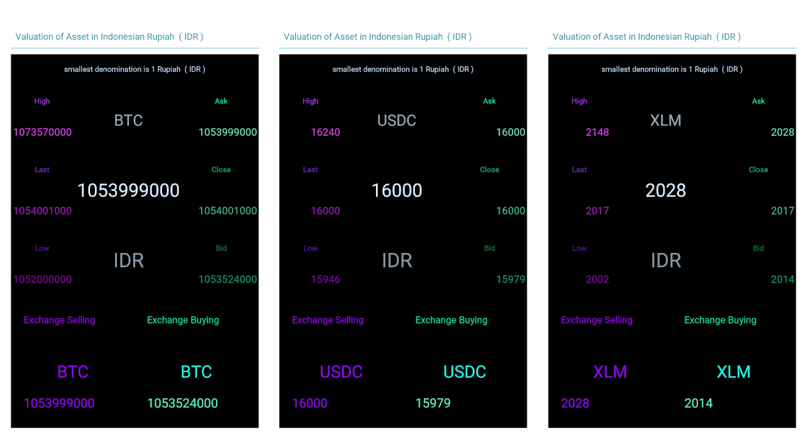

<br />


```json:
BIMA phone


public
synchronized by All Peers
Block

private
isolated hidden protected
Wallet

native asset
sell & buy via auctions
IDR : Indonesian Rupiah

Transaction FEE economics
IDR     1 : 1     BIMA pin id
IDR 1.000 : 1.000 BIMA pin id

Replicated
by
1.000 BIMA pin id

FEE Collection
share
1.000 BIMA pin id

Active Account Activation
Minimal Balance : 10.000 IDR
```


<br />


```json:
BIMA sync & replicate


Block {

    block_height
    block_header_hash
    block_header


    Peer 
        join & re-join
    
    Coin 
        BIMA native asset
    
    Pool 
        p2p sync Mining Pool
    
    Book 
        auctions Sell Buy
    
    Mint 
        instant BIMA Liquidity
    
    Code 
        operations
    
    Data 
        state variables

    Stor
        encrypted secrets

    Scan
        search match fetch

}
```


<br />


```json:
BIMA phone
Transactions FEE economics


How To Mining electronic Cash

or
New Mint IDR instant Liquidity

on
your own BIMA phone ?


Generate New XLM keypair
Activate New XLM Account

synchronized BIMA Chain
buy IDR, sell your XLM


you
as
Claimant to 1 IDR

when
append a New BIMA block

from
Transactions Mining Pool
```


<br />


<br />


<br />


<br />


<br />


<br />


<br />


<br />


<br />


<br />


<br />


<br />


<br />





<br />


<br />


<br />


<br />


<br />


<br />


<br />


<br />


